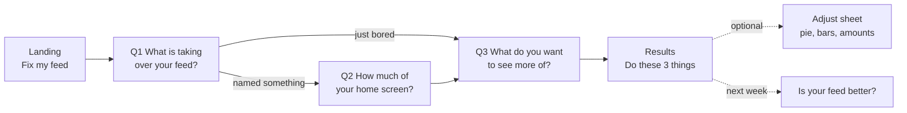

# Algorithm Builder — UX Audit and Plan (Phase 1)

The "Grandma-proof" UX prompt, applied. As of 2026-09-23. **Phase 1 only: nothing in the app has changed.** Everything below is measured against the live build (commit `997e3ca`) unless marked as an estimate. Phase 2 starts only after approval.

**How it was measured.**

- A Chromium browser drove the production build at 390×844 (iPhone-size, touch) and at 320×568 with text at 200%. It counted visible words, controls, controls under 48×48px, text under 18px, overflow, and whether the main button is on screen.
- Reading grade uses the Flesch-Kincaid formula (it's noisy on very short strings).
- Contrast uses the WCAG formula on the app's colour tokens.
- Video IDs came from Wikidata (the open database behind Wikipedia) and were checked one by one against YouTube's oEmbed endpoint.
- WebKit (Safari's engine) isn't installed in this environment, so iPhone-specific rendering couldn't be tested here (see O-1).

---

## 1. Executive summary

**UX grade: 6.7 (D) today → 9.0 (A-) projected.** The app works, and every button is tested, but it asks a lot: **7 screens, 12 taps, and 507 words to read before the results**, then a results page of **450 more words, 4.1 phone screens tall**. At a normal reading pace for a 67-year-old (about 150 words a minute), that's about 4 minutes before she sees anything useful. The fix is to ask less, infer more and say it in fewer words: **4 screens, about 7 taps and 90 words, in about 60 seconds.**

| Screen | Today | Projected | What changes |
| --- | --- | --- | --- |
| Landing | 7.8 C+ | 9.1 A- | One line, one button, reassurance up top |
| Platform | 7.8 C+ | 9.2 A- | No longer a screen: a "YouTube (change)" chip on question 1 |
| Likes | 6.5 D | 8.8 B+ | Moves to question 3; pre-picked suggestions; 200+ topics via search and groups |
| Problem | 6.6 D | 9.4 A | Removed: worked out from what they named |
| Too much of | 6.9 D | 9.0 A- | Becomes question 1, the reason they came |
| Homepage count | 5.7 F | 8.9 B+ | One "just guess" question, four big answers |
| Mix | 5.7 F | 8.7 B+ | Optional "Adjust" sheet behind a one-sentence summary |
| Results | 6.3 D | 9.1 A- | "You're done. Do these 3 things today." Real videos. Everything else folded away |

**Top 10 fixes, ranked by severity × people affected ÷ effort**

| # | Fix | Severity | Affects | Effort |
| --- | --- | --- | --- | --- |
| 1 | O-2: duplicate "Skip to my fix" (class conflict) | P1 | Every phone user | 10 minutes |
| 2 | O-1: main button always visible, fixed to the bottom, never missing | P0 | Every phone user | 2 hours |
| 3 | Copy deck: 6th-grade, jargon out (recipe link, slice, wildcard, tune-up) | P1 | Everyone, most of all 60+ and non-native readers | 1 day |
| 4 | Results: "Do these 3 things today" first, the rest folded | P1 | Everyone | 0.5 day |
| 5 | Text 18px+ and targets 48px+ on phones | P1 | 60+, low vision, one-handed | 1 day |
| 6 | Flow: 7 screens → landing + 3 questions + results | P1 | Everyone | 2 days |
| 7 | Estimate instead of count | P1 | Everyone who names a culprit | 0.5 day |
| 8 | Hand-picked verified videos on the live site | P1 | Everyone on GitHub Pages (no API) | 1 day for the first 35, then ongoing |
| 9 | 200-topic library with search, synonyms and groups | P1 | Everyone with specific tastes | 2 days |
| 10 | 200% text size: no clipping, no sideways scroll | P2 | Anyone with large text on | 0.5 day |

---

## 2. Bug reports

### O-1: Next button missing on the Likes step (P0)

**Reported:** iPhone, Claude app's in-app browser. After tapping YouTube, the Likes screen showed only **Back** in the bottom bar "for a while."

**Reproduction attempts:**

| Environment | Result |
| --- | --- |
| Chromium, 390×844, touch, tap YouTube tile, read the bar immediately | **Not reproduced.** Next is in the DOM and visible in the same frame (`hasNext: true`) |
| Chromium 126-check smoke suite (every step, phone and desktop) | Next visible on every step |
| WebKit (Safari engine) | **Not tested:** not installed here; installing browsers is off-limits in this environment |
| Real iPhone, Safari and in-app browsers | Founder's report only |

**Analysis.** In the code, the content and the bar render from the same state in one pass, so a render where Likes content shows without Next can't happen in React. The bug is almost certainly **WebKit painting**, not logic. The strongest hypothesis: iOS WebKit fails to repaint the children of a `position: sticky` element (the bar) after a big content change, until something forces a repaint, such as a scroll. That fits "for a while." The Platform step's bar had no Next, so the stale paint shows Back only.

**Fix (Phase 2, commit 1):**

1. Make the bar `position: fixed` at the bottom (above the safe area), with matching bottom padding on the page, instead of sticky inside `main`.
2. Key the bar by step, so each step gets a fresh bar element.
3. Always render the main button. When a choice is needed, it's disabled with a reason ("Pick at least one"). It never disappears.
4. Remove the Platform auto-advance screen entirely (see the new flow), which removes the only step without a Next.

**Guard:** a smoke check on every step, at 390×844 and at 320×568 with 200% text, that the main button's centre point returns the button itself from `document.elementFromPoint` (visible, on top, inside the viewport). Plus a manual device check on iOS Safari and one in-app browser before merge, because Chromium can't show a WebKit paint bug.

### O-2: "Skip to my fix" shown twice on phones (P1)

**Confirmed by measurement:** 2 visible "Skip to my fix" buttons at 390px wide.

**Root cause:** the bar's button has `hidden sm:inline-flex`, but `buttonClass()` adds `inline-flex` too. In the built CSS, `.inline-flex` (offset 7878) comes after `.hidden` (offset 7799), so it wins at every width.

**Fix:** remove the in-bar Skip entirely. Keep a single quiet "Skip" text link, only where skipping makes sense (the estimate question).

**Guard:** a smoke check that exactly one visible element with the name "Skip" exists on each step, at phone and desktop widths.

---

## 3. Screen-by-screen audit (today)

Measured at 390×844 unless noted.

| Screen | Words | Controls | Under 48px | Text runs under 18px | Smallest text |
| --- | --- | --- | --- | --- | --- |
| Landing | 126 | 1 | 0 | 10 of 18 | 14px |
| Platform | 32 | 5 | 1 | 10 of 11 | 14px |
| Likes | 55 | 17 | 17 | 19 of 20 | 14px |
| Problem | 73 | 10 | 4 | 16 of 17 | 14px |
| Too much of | 65 | 16 | 16 | 28 of 29 | 14px |
| Homepage count | 55 | 10 | 10 | 10 of 20 | 14px |
| Mix | 101 | 17 | 14 | 28 of 37 | **9px** (pie label) |
| Results | **450** | 14 | 11 | 78 of 85 | 12px |
| **Before results** | **507** | | | | |

**200% text on a 320×568 phone:** pages scroll sideways by 1px (landing), 70px (platform) and 75px (likes). The heading is cut off at the right edge, "Step 2 of 6" runs off screen, and the landing button isn't visible without scrolling.

**Contrast (WCAG):** every text colour passes AA (4.5:1). Only ink and ink-2 pass AAA (7:1) on light. Muted grey is 4.85:1, orange links 5.61:1, the red "turn down" 5.54:1 and green 4.98:1. For this audience, helper text should use ink-2 (7.92:1), not muted.

### Grades (weights: clarity 30%, effort 20%, speed 15%, confidence 15%, accessibility 10%, delight 10%)

| Screen | Clarity | Effort | Speed | Confidence | Access. | Delight | Today | Projected |
| --- | --- | --- | --- | --- | --- | --- | --- | --- |
| Landing | 7.5 | 9.0 | 7.0 | 8.0 | 6.5 | 8.0 | 7.8 C+ | 9.1 A- |
| Platform | 8.0 | 9.0 | 7.0 | 7.0 | 7.0 | 7.5 | 7.8 C+ | 9.2 A- |
| Likes | 7.0 | 6.5 | 6.0 | 6.5 | 5.5 | 7.0 | 6.5 D | 8.8 B+ |
| Problem | 7.0 | 7.0 | 5.5 | 7.0 | 6.0 | 6.5 | 6.6 D | 9.4 A |
| Too much of | 7.5 | 7.0 | 6.5 | 7.0 | 5.5 | 7.0 | 6.9 D | 9.0 A- |
| Homepage count | 6.0 | 3.5 | 5.0 | 7.0 | 7.5 | 6.0 | 5.7 F | 8.9 B+ |
| Mix | 5.0 | 6.0 | 5.0 | 6.5 | 5.0 | 8.0 | 5.7 F | 8.7 B+ |
| Results | 6.0 | 6.5 | 7.0 | 6.0 | 5.5 | 7.5 | 6.3 D | 9.1 A- |
| **Average** | | | | | | | **6.7 D** | **9.0 A-** |

**Why each screen scores the way it does**

- **Landing (7.8):** clear headline and one button, but 126 words and 10 of 18 text runs under 18px. At 200% the button falls below the fold.
- **Platform (7.8):** simple, but "tip guide" and "full tune-up" mean nothing to Linda. It's a whole screen for a choice that is YouTube 90% of the time.
- **Likes (6.5):** all 17 controls are under 48px tall (chips are 44px). The main button went missing on iPhone (O-1). "These become your mix" is jargon. It asks what they like before what's wrong, which is backwards to why they came.
- **Problem (6.6):** a whole screen that can be inferred: anyone who names a culprit has "too much of one thing." 73 words.
- **Too much of (6.9):** the reason they came, asked fourth. "Culprits", "Turn down" and the long helper sentence add reading. Duplicate Skip (O-2).
- **Homepage count (5.7):** see the worked example in the prompt. It leaves the app, needs up to 20 taps, and feels like homework.
- **Mix (5.7):** the most powerful screen and the most confusing one for Linda: "slice", "lock", "split", "100%", three views, a 9px label. Required for everyone, though almost no one needs it.
- **Results (6.3):** everything needed is here, but 450 words over 4 screens. The first thing on screen is a chart, not "you're done". The "recipe link" wording is confusing.

---

## 4. Persona walkthroughs

Times are estimates: reading at 150 words a minute (Linda), 200 (parent, non-native), 250 (founder) and 300 (teen), plus about 3 seconds per tap for Linda and 1.5 for everyone else.

| Persona | Today: taps / words / time | Where they struggle or quit | New: taps / words / time |
| --- | --- | --- | --- |
| **Linda, 67** | 12 / 507 / **~4 min** | Platform ("tip guide"?), Likes (small chips; Next missing on iPhone), Problem (why again?), Count (leaves the app; likely quits here), Mix ("slice", "lock", likely quits here) | **7 / ~90 / ~60 s** |
| **Founder** | ~20 / 507 / ~2.5 min | Wants three saved setups; the recipe link is the only way, and it isn't explained | 14 / ~90 / ~1.5 min (uses Adjust) |
| **Busy parent** | 5 / ~250 / ~1.5 min via Skip | Nothing about the family TV account; results are long | 5 / ~70 / ~35 s |
| **Teen** | 4 / ~200 / ~50 s via Skip | Skims past everything; results wall of text | 5 / ~60 / ~25 s |
| **Non-native speaker** | 12 / 507 / ~3 min | Idioms: tune-up, check-engine, rehab, recipe, culprits, "thumb is a vote" | 7 / ~90 / ~50 s |

**Words Linda asked about (predicted):** algorithm, feed, mix, slice, split, lock, wildcard, time capsule, recipe link, tune-up, rehab playlist, incognito, culprits, turn down.

---

## 5. New flow

**Landing → Q1 What's taking over? → Q2 How much? (only if they named something) → Q3 What do you want more of? → Results.** Mix editing moves to an optional "Adjust" sheet on the results page.



### Phone wireframes (390px wide)

**Landing**
- Gus (medium size), headline "Is your feed stuck on one thing?" (32px), one line "We'll show you what to tap to fix it."
- One full-width button, **Fix my feed**, fixed at the bottom.
- Under the headline, a reassurance line in ink-2: "Free. No sign-in. We never touch your account."
- "Why this happens" moves below the fold, three short cards.
- **Words: about 35 above the fold.**

**Q1: What is taking over your feed?**
- Top: "Question 1 of 3", and a chip "On YouTube · Change" (opens a small sheet with the 4 apps; defaults to YouTube or to `?from=` in the link).
- Search box ("Type a show, game, person or topic") with typeahead over 194 culprits and their nicknames.
- 8 big suggestion chips (48px), then "It's not one thing. My feed is just boring" as a text button, which skips Q2.
- Picked items show as removable chips labelled "Show me less of".
- Fixed bottom button: **Next** (disabled until something is picked or "just boring" is chosen, and the label says so: "Pick one to continue").

**Q2: How much of your home screen is Game of Thrones?**
- "Just guess. We'll ask again next week."
- Four stacked full-width answers (56px tall): **Almost all · About half · Some · A little**. Tapping one moves on automatically (single choice).
- One "Skip" text link.

**Q3: What do you want to see more of?**
- "Pick a few." The search box matches 202 topics, nicknames and typos.
- 8–12 suggested chips, **3 pre-selected** based on Q1 (sick of Game of Thrones → Fantasy books, Medieval history, Documentaries). The same franchise is never suggested back.
- "See all topics" opens the 20 groups as expandable rows.
- Fixed bottom button: **Show my fix** (enabled from the start, because of the pre-selections).

**Results**
1. "You're done. Do these 3 things today." Three big numbered cards, each with one action link (Open history, etc.). "More ways to fix it (4)" is folded.
2. "Watch a few of these this week": 6–10 video cards (thumbnail, title, channel, year), labelled **Hand-picked** or **From YouTube**. One line: "Watch a few minutes of each. Save the ones you like."
3. "Your new feed": one sentence ("Mostly cooking and garden videos. Some history. A few new things.") plus a thin stacked bar and an **Adjust** button that opens the current pie/bars/numbers editor as a sheet.
4. "Check again next week": **Remind me next week** (calendar) and **Save this page** (copy link, explained as "Save this page to come back to it").
5. Tips ("Keep it fixed") folded by default.

**Desktop:** same order in a 720px column. Q1–Q3 keep the fixed bottom bar. On results, the Adjust editor opens as a right-side panel instead of a full-screen sheet.

---

## 6. Copy deck

55 key strings. Reading grade is Flesch-Kincaid (noisy for very short strings). **Totals: 465 → 342 words; average grade 2.6 → 0.8; no proposed string above grade 6.** Every other string in the app follows the same glossary in Phase 2.

| Screen | Current | Proposed | Grade | Words |
| --- | --- | --- | --- | --- |
| Landing | Fix a feed that’s stuck on one topic. | Is your feed stuck on one thing? | 0.8 → 0 | 8 → 7 |
| Landing | Tell us what took over your YouTube, Instagram, TikTok or X feed and what you’d rather see. You get the exact settings to change and a playlist that pulls your feed back toward your mix. | We’ll show you what to tap to fix it. | 6.4 → 0 | 35 → 9 |
| Landing | Start my tune-up (2 min) | Fix my feed | 0 → 0 | 5 → 3 |
| Landing | No login. Nothing leaves your browser. | Free. No sign-in. We never touch your account. | 3.3 → 1.7 | 6 → 8 |
| Landing | Why feeds get stuck | Why this happens | 0 → 1.3 | 4 → 3 |
| Landing | You watch one video about something. The app treats it as a strong hint. | You watch one video. The app shows you more like it. | 2.3 → 0 | 14 → 11 |
| Landing | Every pick confirms it. Soon it’s 20 of the same thing. | Each time you click, it shows you even more. | 0.5 → 1.0 | 11 → 9 |
| Landing | The fix: remove first, then add. Your thumb is a vote, even when you don’t mean it. | The fix: remove the old ones, then watch new ones. | 0.9 → 1.3 | 17 → 10 |
| Platform | Which feed are we fixing? | Which app? (YouTube)  Change | 0.5 → 0 | 5 → 4 |
| Platform | YouTube gets the full tune-up. The others get a tip guide. | We can fix YouTube. For the others we give you tips. | 1.6 → 0.5 | 11 → 11 |
| Question 1 | Too much of what? | What is taking over your feed? | 0 → 2.5 | 4 → 6 |
| Question 1 | Name the shows, games, creators or topics that took over. Anything works. | Tap one or type it. | 3.5 → 0 | 12 → 5 |
| Question 1 | Turn down (2) | Show me less of (2) | 0 → 0 | 3 → 5 |
| Question 1 | Common culprits | Common ones | 8.8 → 2.9 | 2 → 2 |
| Question 1 | What’s wrong with it? | (removed: worked out from Question 1) | 0 → 0.5 | 4 → 6 |
| Question 1 | My feed is only Game of Thrones since I rewatched one scene… | e.g. Game of Thrones | 2.9 → 0 | 12 → 5 |
| Question 2 | Count your homepage (optional) | How much of your home screen is Game of Thrones? | 9.6 → 0.1 | 4 → 10 |
| Question 2 | Open your YouTube homepage and count the first 20 videos. Next week you’ll count again and see what changed. | Just guess. We’ll ask again next week. | 3.0 → 0 | 19 → 7 |
| Question 2 | Stuff I actually want | Almost all / About half / Some / A little | 3.7 → 4.0 | 4 → 7 |
| Question 3 | What do you actually want to see? | What do you want to see more of? | 2.3 → 0 | 7 → 8 |
| Question 3 | Pick up to 7. These become your mix. | Pick a few. | 0 → 0 | 8 → 3 |
| Question 3 | Search or add your own (e.g. Lego Technic) | Search, or type your own | 0.0 → 0 | 9 → 5 |
| Question 3 | Pick nothing and we’ll start you on comedy, science and a surprise. | Not sure? We picked some for you. | 4.8 → 0 | 12 → 7 |
| Question 3 | More topics (21) | See all topics | 0 → 1.3 | 3 → 3 |
| Nav | Step 2 of 6 | Question 2 of 3 | 0 → 0 | 4 → 4 |
| Nav | Skip to my fix | Skip | 0 → 0 | 4 → 1 |
| Nav | Looks good, build my fix | Show my fix | 0 → 0 | 5 → 3 |
| Mix | Build your mix | Your new feed | 0 → 0 | 3 → 3 |
| Mix | Drag the sliders. Everything always adds up to 100%. Tap a slice to split it further. | Mostly cooking and garden videos. Some history. A few new things. | 2.0 → 4.1 | 16 → 11 |
| Mix | Something I’d never click | Surprise me | 6.6 → 2.9 | 4 → 2 |
| Mix | Time capsule | Add great old videos | 8.8 → 0.7 | 2 → 4 |
| Mix | Great videos from years ago that the algorithm forgot. | Great old videos you may have missed. | 5.0 → 0.6 | 9 → 7 |
| Mix | Lock this slice | Keep this amount | 0 → 1.3 | 3 → 3 |
| Mix | Split | Choose shows | 0 → 0 | 1 → 2 |
| Mix | This is the mix we’ll steer toward. Feeds shift over 3–7 days. | Your feed will change over a few days. | 0 → 0.8 | 13 → 8 |
| Results | Here’s your fix. | You’re done. Do these 3 things today. | 0 → 0 | 3 → 7 |
| Results | Remove first, then add. Two steps, about 10 minutes. | It takes about 10 minutes. | 0.6 → 0.5 | 9 → 5 |
| Results | Step 1. Clean up | 1. Remove what you’re tired of | 0 → 0 | 4 → 6 |
| Results | Removing what caused the loop works faster than anything you add on top. | This works faster than anything else. | 5.8 → 4.4 | 13 → 6 |
| Results | Delete “Game of Thrones” videos from your watch history | Delete Game of Thrones videos from your history | 5.0 → 5.2 | 9 → 8 |
| Results | Search your history for it and remove each one. This is the single biggest fix. | Search your history for it. Tap the X on each one. | 3.1 → 0.5 | 15 → 11 |
| Results | Before any one-off curiosity watch: pause watch history (or use incognito) | Want to watch it just once? Pause your history first. | 11.2 → 0.5 | 11 → 10 |
| Results | Step 2. Watch your rehab playlist | 2. Watch a few of these this week | 0 → 0 | 6 → 8 |
| Results | Ten videos matched to your mix. Over the next few days: | Watch a few minutes of each. Save the ones you like. | 0.5 → 0 | 11 → 11 |
| Results | Pick the video that looks best in each search. Skip anything about what you’re turning down. | Tap a topic. Pick a video that looks good. | 3.0 → 0.6 | 16 → 9 |
| Results | Keep it healthy | 3. Keep it fixed | 1.3 → 0 | 3 → 4 |
| Results | Your thumb is a vote, even when you don’t mean it. | The app learns from what you tap. | 1.6 → 0 | 11 → 7 |
| Results | Scroll past within a second or two | Scroll past fast | 2.3 → 0 | 7 → 3 |
| Results | Never hate-watch or hate-comment: anger still counts | Don’t comment on things that make you mad | 10.7 → 0.8 | 7 → 8 |
| Results | Come back in a week | Check again next week | 0 → 0.7 | 5 → 4 |
| Results | Your recipe link holds your whole mix. Bookmark it, no account needed. Next week, open it, re-count your homepage and adjust. | Save this page to come back to it. | 4.0 → 0 | 21 → 8 |
| Results | Copy my recipe link | Copy my link | 3.7 → 1.3 | 4 → 3 |
| Results | Add tune-up to calendar | Remind me next week | 6.6 → 0.7 | 4 → 4 |
| Results | Feed running better? The mechanic runs on coffee. | Did this help? You can buy us a coffee. | 5.1 → 0 | 8 → 9 |
| Error | YouTube’s search is busy right now, so here are links that do the same job. | YouTube is busy. These links work just as well. | 3.6 → 0.6 | 15 → 9 |

**Glossary for Phase 2 (words that don't appear in the UI any more)**

| Retired | Use instead |
| --- | --- |
| algorithm | your feed / what the app shows you |
| mix | your new feed / what you want more of |
| slice, category, sub-topic | topic / type of video |
| wildcard, "Something I'd never click" | Surprise me |
| time capsule | Add great old videos |
| recipe link | your link / save this page |
| tune-up, check-engine light | check again next week |
| rehab playlist | videos to watch this week |
| lock / split | keep this amount / choose shows |
| turn down, culprits | show me less of / common ones |
| incognito | private window (only in the "More ways" section) |

The mechanic mascot and his voice stay; the idioms go. Gus says less and shows more.

---

## 7. Topic library (draft)

**202 topics in 20 groups and 194 "show me less of" entries.** The full table is in [`ux/TAXONOMY.md`](ux/TAXONOMY.md); the data is in `docs/ux/taxonomy.draft.json`, one data file with this shape:

```json
{
  "version": 1,
  "topics": [
    {
      "id": "gospel-worship",
      "label": "Gospel & worship",
      "group": "Music",
      "subtopics": [{ "label": "Gospel choirs", "query": "gospel choir live" }],
      "synonyms": ["church music", "christian music", "hymns"],
      "audience": "general | kids-safe",
      "suggested": false,
      "popularWith": ["60+"],
      "starterVideos": ["<verified YouTube id>"]
    }
  ],
  "culprits": [{ "id": "game-of-thrones", "label": "Game of Thrones", "synonyms": ["GOT", "Thrones", "House of the Dragon"] }]
}
```

**Maintenance:** one data file, reviewed quarterly. A unit test enforces unique ids, 2–4 sub-topics each, a non-empty query per sub-topic, and that every `starterVideos` id exists in the verified pool.

**Suggest-instead map (automation for Q3):** each culprit maps to 2–3 positive alternatives from a different franchise or group (for example Game of Thrones → Fantasy, Medieval history, Documentaries; Fortnite → Game design, Esports, Lego & models; Politics commentary → News explained, History, Nature relaxing). Drafted in Phase 2 alongside the list, since it depends on the final ids.


---

## 8. Real videos: the verified pool

**Facts checked:**

| Claim | Status |
| --- | --- |
| `youtube.com/oembed?url=…&format=json` returns 200 with title and channel for a real public video, and 400 for a made-up id | **VERIFIED** 2026-09-23 (a known 3Blue1Brown video → 200; `zzzzzzzzzzz` → 400) |
| Wikidata stores YouTube video ids (property P1651) for notable works | **VERIFIED**: 690 animated shorts, 1,410 music videos, 1,472 short films, 60 speeches, 51 lectures, 52 web series, 84 TV programmes carry one |
| `youtube.com/watch_videos?video_ids=…` builds a play-all queue | **UNVERIFIED**: YouTube served a captcha to this machine. Test by hand on iPhone and Android before relying on it |
| Showing YouTube thumbnails and titles from a stored list is allowed | **UNVERIFIED for oEmbed data specifically.** The YouTube API policies (checked for the review) require refreshing stored API data within 30 days and proper attribution. Phase 2: read the oEmbed and branding guidelines, cite them, and re-verify the pool at least every 30 days |

**What the first batch showed:**

- 120 candidates across 10 Wikidata categories were checked, and **all 120 were real** (oEmbed 200).
- **Only 35 met the quality rules**, and 7 of those still carry a flag for a human to check. The rest were foreign-language uploads, trailers, political content, channel re-uploads, horror, or near-duplicates.
- Lesson: Wikidata is a good, legitimate source for **timeless classics** (old films, silent films, classic music videos, animation). It's a poor source for modern topics like cooking, gardening, fitness or science explainers.

The prompt asked for 50. Stopping at 35 good ones is more honest than padding to 50 with bad ones.

**The first 35 verified videos** (all oEmbed 200 on 2026-09-23; source ids in `docs/ux/pool.draft.json`):

| # | Video | Channel | Year | Maps to topic | oEmbed | Note |
| --- | --- | --- | --- | --- | --- | --- |
| 1 | [WING IT! - Blender Open Movie](https://www.youtube.com/watch?v=u9lj-c29dxI) | Blender Studio | ? | short-films | 200 |  |
| 2 | [Terrarium / Animated Short Film (2023)](https://www.youtube.com/watch?v=h7s3edIw_Rk) | Maximpy | 2023 | short-films | 200 |  |
| 3 | [PHONEY NEWS FLASHES](https://www.youtube.com/watch?v=RRfRQB4RMW0) | Terry Toons | 1955 | short-films | 200 |  |
| 4 | [Save Ralph - A short film with Taika Waititi](https://www.youtube.com/watch?v=G393z8s8nFY) | Humane World for Animals | 2021 | short-films | 200 | heavy theme (animal testing); not kids-safe |
| 5 | [Fractured Fables The Fuz](https://www.youtube.com/watch?v=WVmBQr1BGuE) | ITSALL80STOME | 1967 | short-films | 200 | likely unofficial upload; check rights |
| 6 | [Angel And The Badman - J.E.Grant - 1947](https://www.youtube.com/watch?v=Me0pxCripM0) | 4K Vintage Movie Archive | 1947 | classic-films | 200 |  |
| 7 | [Renegade Girl (1946) - Full Movie](https://www.youtube.com/watch?v=BmZX3f4O6W0) | Freemeo | 1946 | classic-films | 200 |  |
| 8 | [The Courageous Dr. Christian (1940) - Full Movie](https://www.youtube.com/watch?v=oM3IBGiq_Gs) | Freemeo | 1940 | classic-films | 200 |  |
| 9 | [So This is Washington (1943) - Full Movie](https://www.youtube.com/watch?v=QpPwuYf6EOE) | Freemeo | 1943 | classic-films | 200 |  |
| 10 | [Prestaties - Prestations (1952)](https://www.youtube.com/watch?v=gb4TciKmHxY) | CINEMATEK | 1952 | classic-films | 200 |  |
| 11 | [Charlot attore (1915) Charlie Chaplin](https://www.youtube.com/watch?v=3SgaLoPxOtQ) | iconauta | 1915 | classic-films/silent | 200 |  |
| 12 | [The X Rays (1897)](https://www.youtube.com/watch?v=3gMCkFRMJQQ) | BFI | 1897 | classic-films/silent | 200 |  |
| 13 | [The Ocean Waif (1916) [2018 version]](https://www.youtube.com/watch?v=i7KtmXY2_3w) | psatioat | 1916 | classic-films/silent | 200 |  |
| 14 | [Conrad in Quest of His Youth 1920](https://www.youtube.com/watch?v=drspHrPuTr0) | Public Domain Movies - Class | 1920 | classic-films/silent | 200 |  |
| 15 | [L'Homme aux gants blancs (1908) A Pair of White Gloves (Pathé)](https://www.youtube.com/watch?v=GFrnnx42eJE) | Films by the Year | 1908 | classic-films/silent | 200 |  |
| 16 | [Guns N' Roses - Sweet Child O' Mine (Official Music Video)](https://www.youtube.com/watch?v=1w7OgIMMRc4) | GunsNRosesVEVO | 1988 | oldies/rock/pop | 200 |  |
| 17 | [Kate Bush - Army Dreamers - Official Music Video](https://www.youtube.com/watch?v=QOZDKlpybZE) | KateBushMusic | 1980 | oldies/rock/pop | 200 |  |
| 18 | [Orchestral Manoeuvres In The Dark - So In Love](https://www.youtube.com/watch?v=mD8TApX3btM) | OMDVEVO | 1985 | oldies/rock/pop | 200 |  |
| 19 | [Sunday Bloody Sunday (Live From Red Rocks Amphitheatre, Colorado, USA ](https://www.youtube.com/watch?v=EM4vblG6BVQ) | U2VEVO | 1983 | oldies/rock/pop | 200 |  |
| 20 | [Boyzone - Father And Son (UK Edit)](https://www.youtube.com/watch?v=PqBEi2vfxAs) | BoyzoneVEVO | 1995 | oldies/rock/pop | 200 |  |
| 21 | [From the archives: John F. Kennedy's "Ich bin ein Berliner" speech on ](https://www.youtube.com/watch?v=qK1ol_IG77c) | CBS News | 1963 | famous-speeches | 200 |  |
| 22 | [Historian Ron Chernow Speaks At The White House Correspondents' Dinner](https://www.youtube.com/watch?v=-rCHwNWMw6E) | NBC News | 2019 | famous-speeches | 200 | political event; check tone |
| 23 | [Behind the Scenes of the Cinematic Dialogues in The Witcher 3: Wild Hu](https://www.youtube.com/watch?v=chf3REzAjgI) | GDC Festival of Gaming | 2016 | interviews-long-talks/game-design/courtroom/science | 200 |  |
| 24 | [Don't Talk to the Police](https://www.youtube.com/watch?v=d-7o9xYp7eE) | Regent University School of  | 2008 | interviews-long-talks/game-design/courtroom/science | 200 |  |
| 25 | [Closing Arguments in the Decade-Long Clovis Comet Trial: Not Guilty! M](https://www.youtube.com/watch?v=aJmfmFymPus) | SandiaGranite | 2018 | interviews-long-talks/game-design/courtroom/science | 200 |  |
| 26 | [Patrick Deelen. Big data analysis of public datasets to improve the ge](https://www.youtube.com/watch?v=sHDhGIhhiZM) | InformationUniverse | 2018 | interviews-long-talks/game-design/courtroom/science | 200 | niche genomics talk |
| 27 | [Mistakes Have Been Made / Karen Coyle](https://www.youtube.com/watch?v=d0CMuxZsAIY) | SWIB | 2015 | interviews-long-talks/game-design/courtroom/science | 200 | niche library-data talk |
| 28 | [Broken Ways (1913) Biograph](https://www.youtube.com/watch?v=74nPatzoNEk) | Films by the Year | 1913 | short-films/drama | 200 |  |
| 29 | [Horror Short Film "Here There Be Monsters" / ALTER](https://www.youtube.com/watch?v=QAcbR5fY5-A) | ALTER | 2018 | short-films/drama | 200 | horror; not kids-safe |
| 30 | [Salad Mug - DYNAMO DREAM, Ep1](https://www.youtube.com/watch?v=LsGZ_2RuJ2A) | IanHubert | ? | sci-fi/travel/minecraft-builds (web series) | 200 |  |
| 31 | [Prepare for Execution - DYNAMO DREAM - Ep2](https://www.youtube.com/watch?v=29E-HNTWEOE) | IanHubert | ? | sci-fi/travel/minecraft-builds (web series) | 200 |  |
| 32 | [A Single Point in Space - DYNAMO DREAM, Ep3](https://www.youtube.com/watch?v=xlqhdaLhRVY) | IanHubert | ? | sci-fi/travel/minecraft-builds (web series) | 200 |  |
| 33 | [Who Are We? The Great American Road Trip](https://www.youtube.com/watch?v=QPNmTYUi9DY) | US Department of Transportat | ? | sci-fi/travel/minecraft-builds (web series) | 200 |  |
| 34 | [VERITY™ [FULL MINECRAFT MOVIE]](https://www.youtube.com/watch?v=f6f3PhauXyg) | ThatMob | ? | sci-fi/travel/minecraft-builds (web series) | 200 | fan film; check tone |
| 35 | [Invisible Thread - Full Movie - 1987](https://www.youtube.com/watch?v=pSUbn3sYJZw) | Penn & Teller | 1987 | classic-comedy (TV) | 200 |  |

**How the pool reaches 200 topics (plan):**

1. **Source:**
   - Classics from Wikidata (as above).
   - Modern topics from the YouTube Data API once a key exists: 1 search per topic, top results filtered by the quality rules. That's 202 searches, about 2 days of the default quota, done once, not per visitor.
   - Hand-picks from the founder: paste a URL and the script verifies it.
2. **Verify:** a script (`scripts/verify-pool.mjs`, Phase 2) checks every id with oEmbed, fails CI if any is gone, and refreshes titles. It runs weekly (well inside the 30-day refresh rule) and on every change to the pool file.
3. **Curate:** a human reviews each candidate against the rules: English or no dialogue, family-safe unless the topic isn't, 5–20 minutes preferred, no rage-bait, max 1 per channel per playlist. That's about 10 minutes per topic, so **3 per topic at launch = about 600 videos, about 35 hours**, or launch with the top 60 topics (about 180 videos, about 10 hours) and grow.
4. **Serve:**
   - The pool comes first: instant, zero quota, and it works on GitHub Pages.
   - The API tops it up when available.
   - Search links only when both are empty.
   - Cards say **Hand-picked** or **From YouTube**.
5. **Never:** an id that didn't come from a real source and pass oEmbed.

---

## 9. Automation proposals (graded)

Same weights as section 3. "Taps saved" is for Linda's path.

| Proposal | Clarity | Effort | Speed | Confidence | Access. | Delight | Score | Taps saved |
| --- | --- | --- | --- | --- | --- | --- | --- | --- |
| Remove the Problem screen; infer "too much of one thing" from Q1 | 9.5 | 10 | 10 | 8.5 | 9.5 | 8 | **9.4 A** | 2 |
| Platform as a chip on Q1, default YouTube, `?from=` sets it | 9 | 10 | 9.5 | 9 | 9 | 8 | **9.2 A-** | 1 |
| Pre-select 3 Q3 topics from what they're sick of | 9 | 9.5 | 9 | 8.5 | 9 | 9 | **9.0 A-** | 2 |
| Estimate question only when something was named, auto-advance | 9.2 | 9.5 | 8.5 | 8.5 | 9 | 8 | **8.9 B+** | 15+ |
| Mix built automatically; summary sentence + optional Adjust | 8.8 | 9 | 8.5 | 8.5 | 8.5 | 8.5 | **8.7 B+** | 1 plus all slider work |
| Results: top 3 actions first, the rest folded | 9.2 | 8.8 | 9.2 | 9.3 | 9 | 8.8 | **9.1 A-** | 0 (reading: about −300 words) |
| Return visit: one question "Is your feed better?" → adapt advice | 9 | 9.5 | 9 | 9 | 9 | 9 | **9.1 A-** | Count step replaced |

---

## 10. Accessibility and mobile test matrix

| Check | Devices / settings | Pass when |
| --- | --- | --- |
| Main button visible on every step | 390×844; 320×568 at 200% text; iOS Safari; one in-app browser (Claude, Instagram or TikTok) | `elementFromPoint` at its centre returns the button; manually seen on device |
| No sideways scroll | 320, 390 and 1280 wide; 100% and 200% text | `scrollWidth ≤ clientWidth` on every screen |
| Body text size | Phones | No UI text under 16px; body and helper text ≥ 18px |
| Tap targets | Phones | Every control ≥ 48×48px, ≥ 8px apart |
| Contrast | Light and dark | Body and helper text ≥ 7:1 (AAA); other text ≥ 4.5:1 |
| Screen readers | VoiceOver (iPhone), TalkBack (Android) | Each step announces its question; every control has a clear name; the chart has a list equivalent |
| Reduced motion | OS setting on | Nothing animates (already tested) |
| Keyboard | Desktop | Every step completes with Tab, Enter and Space; focus is always visible |
| Language | Browser translation on (Spanish) | No layout break; no idioms left untranslated |

**Automated in the smoke suite:** rows 1–5 and 7–8. **Manual before each release:** rows 1 (on a device), 6 and 9.

---

## 11. Usability test kit

**Participants:** 5, including at least one person over 60 who isn't technical and one on Android.

**Script** (read aloud, the same each time):

> "This is a website that's supposed to help with YouTube. I didn't make it, so you can't hurt my feelings. Please think out loud. I can't help you once we start."

**Tasks:**
1. "Pretend your YouTube is full of [their real annoyance, or 'political videos']. Use this to fix it."
2. "Show me where you'd go to see more cooking videos."
3. "Save this so you can come back next week."
4. "What will you do first after you close this?"

**Record per task:**
- done without help (yes/no)
- seconds
- pauses over 3 seconds
- words they asked about
- the moment they'd quit, if any

**After:** the 10-question System Usability Scale, and "In one sentence, what does this site do?"

**Targets:** the 60+ participant finishes task 1 in under 90 seconds without help; average SUS ≥ 80; zero words asked about; 5 of 5 describe it correctly.

**One-page results template:** a table with participants as rows and the task measures as columns, then SUS, then the top 3 problems seen by 2 or more people.

---

## 12. Test plan additions (Phase 2)

| New behaviour | Check |
| --- | --- |
| Main button always present and on top (O-1) | Smoke: every step at 390×844 and at 320×568 with 200% text, `elementFromPoint` hits the button |
| One Skip only (O-2) | Smoke: exactly one visible "Skip" per step, phone and desktop |
| Estimate answer → before/after number | Unit: mapping (Almost all 90, About half 50, Some 25, A little 10); smoke: answer, reopen link, "Is it better?" shows a change |
| Q2 only when something is named | Smoke: the "just boring" path skips Q2 |
| Pre-selected Q3 topics never include the culprit's franchise | Unit over every culprit in the map |
| Pool integrity | Unit: every `starterVideos` id is in the pool; CI script: every pool id passes oEmbed |
| Hand-picked labelled honestly | Smoke: pool videos show "Hand-picked", API videos "From YouTube" |
| Copy stays simple | Unit: every string in a `copy.ts` file scores ≤ grade 6, and no glossary word appears |
| Text size and targets | Smoke: no text under 16px and no control under 48px on phones |
| Old links still work | Unit: `v: 1` recipes decode into the new format |
| Taxonomy integrity | Unit: unique ids, 2–4 sub-topics, queries present, synonyms lowercase-unique |

---

## 13. Phase 2 order (after approval)

1. O-1 and O-2 fixes with guards; manual iPhone check.
2. Copy deck and glossary (all strings moved to one `copy.ts`).
3. Flow restructure (landing → 3 questions → results; Adjust sheet).
4. Estimate question and the "Is it better?" return visit.
5. Topic library (202 topics, 194 culprits, suggest-instead map).
6. Verified pool (35 now, growth plan) plus the verification script.
7. Automation (pre-selections, platform chip, `?from=`).
8. Accessibility pass (18px, 48px, AAA helper text, 200% text).

Each step is its own commit with tests, screenshots in light and dark on phone and desktop, and README and REVIEW updates.

---

## 14. Open questions for the founder

- [ ] **Keep the mechanic voice at all?** The copy deck keeps Gus but drops the car idioms. Want Gus to say even less?
- [ ] **Q1 first:** OK to ask what's taking over before what they like? (It's why they came.)
- [ ] **Launch pool size:** 60 topics × 3 videos (about 10 hours of curation), or all 202 topics (about 35 hours)?
- [ ] **Who curates?** You, or you plus 2–3 friends with a shared checklist?
- [ ] **YouTube API key:** can we get one before Phase 2 step 6? It's the fastest way to fill modern topics.
- [ ] **Flagged videos:** keep or drop the 7 flagged picks (horror short, animal-testing short, fan film, WHCD speech, unofficial cartoon upload, 2 niche talks)?
- [ ] **Instagram, TikTok and X:** keep them as tip guides in the app selector, or hide them until they have more than tips?
- [ ] **Test participants:** who is the 60+ person for the usability test?
